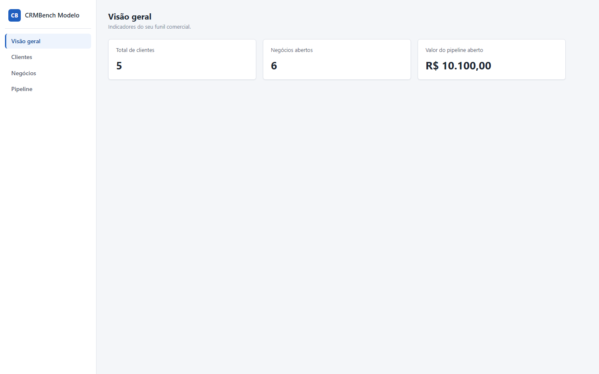
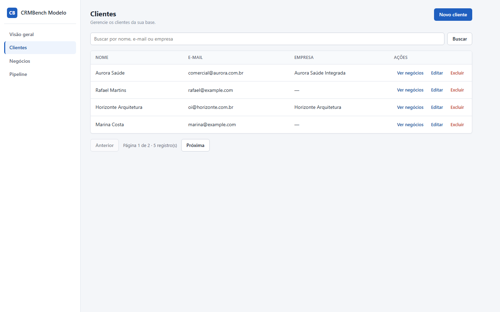
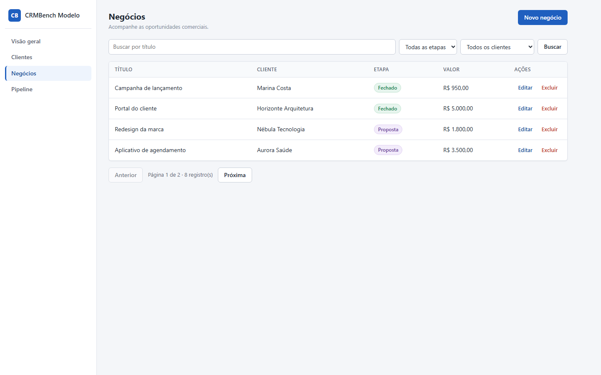
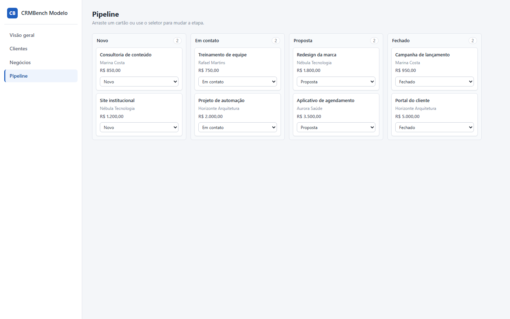

# Relatório da avaliação — claude-opus-4-8__openrouter__2026-07-29

**Nota:** 96/100
**Resultado:** 21 passaram, 1 falhou e 0 não puderam ser executados.

## Execução

| Campo | Valor |
|---|---:|
| Modelo | `anthropic/claude-opus-4.8` |
| Provider | OpenRouter |
| Harness | OpenCode 1.18.9 |
| Raciocínio | `high` |
| Custo da criação | US$ 2,54 |
| Tempo oficial | 11m20s |
| Turnos | 46 |
| Chamadas de ferramentas | 47 |

A execução foi concluída de forma autônoma, com uma única mensagem do usuário.
As 47 chamadas de ferramentas terminaram normalmente e nenhum processo de
servidor ficou pendente.

## Screenshots

### Dashboard

### Clientes

### Negócios

### Pipeline

## Resumo em linguagem simples

### O que funcionou

- **Instalação:** As dependências foram instaladas sem flags de contorno.
- **Preparação do banco:** O banco foi recriado duas vezes com o seed correto.
- **Build de produção:** O frontend e o servidor foram compilados para produção.
- **Inicialização:** A aplicação iniciou e serviu API e interface na mesma origem.
- **Criação de cliente:** Um cliente válido foi criado e persistido.
- **Listagem de clientes:** A listagem, a busca e a paginação de clientes refletiram o banco.
- **Edição de cliente:** A atualização parcial preservou os demais campos.
- **Exclusão e integridade de clientes:** A exclusão funcionou sem corromper negócios relacionados.
- **Criação de negócio:** Um negócio válido foi criado e ligado ao cliente correto.
- **Listagem de negócios:** A listagem, a busca, os filtros e a paginação de negócios refletiram o banco.
- **Edição de negócio:** A atualização parcial do negócio persistiu corretamente.
- **Exclusão de negócio:** O negócio solicitado foi excluído sem afetar outros dados.
- **Precisão dos indicadores:** Os indicadores acompanharam exatamente os dados persistidos.
- **Visualização do pipeline:** As quatro etapas e seus cartões apareceram na ordem correta.
- **Persistência do pipeline:** A nova etapa permaneceu salva após reiniciar o servidor.
- **Drag-and-drop do pipeline:** Um cartão pôde ser arrastado e permaneceu na nova etapa.
- **Fluxo visual de clientes:** CRUD, busca, paginação visível de 4 itens e visualização dos negócios do cliente funcionaram.
- **Fluxo visual de negócios:** CRUD, busca, filtros e paginação visível de 4 itens funcionaram pela interface.
- **Feedback e responsividade:** Erros e estados foram visíveis e a interface respondeu bem no celular.
- **Nome da aplicação:** O produto foi identificado como CRMBench Modelo.
- **Testes e documentação:** Os testes essenciais passaram e o README explicou os comandos.

### O que não funcionou

- **Validação de negócios:** A API aceitou um negócio inválido ou gravou dados parciais.
  - Evidência técnica: status de erro: esperado 400, recebido 404.

## Resultado por verificação

| Verificação | Resultado | Pontos | Evidência |
|---|---:|---:|---|
| setup.install | PASS | 2/2 | npm install concluiu em 5253 ms com a stack obrigatória. |
| setup.database | PASS | 3/3 | db:setup recriou duas vezes o banco isolado indicado por DB_PATH. |
| setup.build | PASS | 4/4 | O build de produção concluiu em 4318 ms. |
| setup.start | PASS | 5/5 | npm start serviu a API e a interface na mesma origem. |
| clients.create | PASS | 5/5 | Cliente 6 foi criado com campos normalizados e timestamps válidos. |
| clients.read | PASS | 4/4 | Listagem, busca case-insensitive e páginas de clientes refletiram o banco. |
| clients.update | PASS | 4/4 | A edição parcial mudou o nome, preservou o e-mail e atualizou o timestamp. |
| clients.delete | PASS | 5/5 | Cliente sem vínculo foi excluído; cliente com negócio recebeu 409 sem cascata. |
| deals.create | PASS | 6/6 | Negócio 9 foi criado e ligado ao cliente 6. |
| deals.read | PASS | 4/4 | Listagem, busca, filtros combinados e paginação de negócios refletiram o banco. |
| deals.update | PASS | 5/5 | A edição parcial persistiu a etapa e preservou os demais campos. |
| deals.delete | PASS | 4/4 | O negócio solicitado foi excluído sem remover clientes ou outros dados. |
| deals.validation | FAIL | 0/4 | status de erro: esperado 400, recebido 404. |
| metrics.accuracy | PASS | 8/8 | Os indicadores conferiram antes e depois de criar, fechar e excluir um negócio. |
| pipeline.render | PASS | 6/6 | As quatro etapas, na ordem correta, exibiram todos os negócios persistidos. |
| pipeline.persistence | PASS | 6/6 | A etapa mudou pela interface e permaneceu no SQLite após reiniciar o servidor. |
| pipeline.drag_drop | PASS | 5/5 | O cartão foi arrastado e permaneceu na nova coluna após reiniciar o servidor. |
| ui.client_flow | PASS | 5/5 | Paginação, busca, negócios relacionados e CRUD de clientes funcionaram pela interface. |
| ui.deal_flow | PASS | 5/5 | Paginação, busca, filtros combinados e CRUD de negócios funcionaram pela interface. |
| ui.feedback | PASS | 4/4 | Erro, sucesso, confirmação e estado vazio ficaram visíveis, sem overflow nas duas viewports. |
| ui.app_name | PASS | 1/1 | O título do navegador e a marca visível usam CRMBench Modelo. |
| quality.tests_docs | PASS | 5/5 | 4 testes passaram e o README documentou os cinco comandos obrigatórios. |

_Relatório produzido automaticamente pelo avaliador externo._
